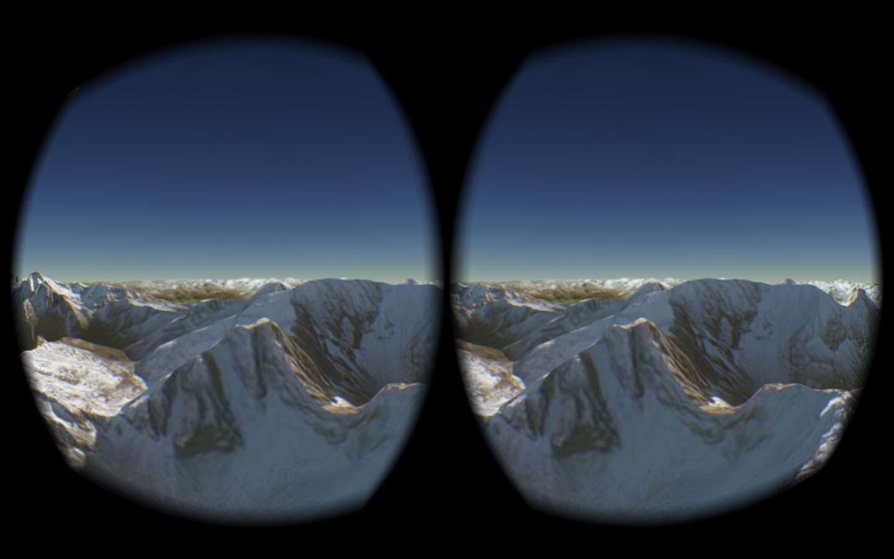

<a href="http://nicta.com.au/"></a>
<br>

# cesium-vr

A plugin for [Cesium WebGL Virtual Globe](http://cesiumjs.org) to support VR devices using a VR-enabled browser. Install [Firefox VR](http://mozvr.com/downloads.html) and try the [live demo](http://nicta.github.io/cesium-oculus-plugin/).

[](http://nicta.github.io/cesium-oculus-plugin/)

## Usage

* Install [Firefox VR](http://mozvr.com/downloads.html), an experimental Firefox build with VR interfaces.
* Run via a local http server, e.g. with node.js http-server

    ```bash
    cd cesium-vr
    http-server
    ```

* (optional) Plug in your VR headset. The code should still work even if you don't have one.
* Start up Firefox VR and visit `http://localhost:8080`.
* Hit `Enter` to make the browser fullscreen on your VR display.
* The mouse can be used on the left eye to navigate.  Number keys take you to some pre-set locations. Hit `L` at any time to level the camera to the globe surface.
* The `WASD` keys allow horizontal movement with `Q` and `E` allowing vertical movement. Holding `Shift` speeds up all movement.

If you are having any problems, visit [mozvr.com](http://mozvr.com) to check you have correctly configured your VR device for use in Firefox VR. If you're still having troubles, feel free to post an issue on the GitHub repository.

## About

### Stereo Rendering
To render stereo images within Cesium using a single scene and dual canvases the workflow is as follows.

For each frame:

* Set scene and camera parameters for right eye.
* Render into left eye canvas.
* Canvas copy from left eye canvas to right eye canvas.
* Set scene and camera parameters for left eye.
* Render into left eye canvas.

### Frustum offsetting
We have applied a small modification to Cesium's PerspectiveFrustum class.
This allows us to apply the required frustum offset e.g. so the standard globe doesn't render in the center of each canvas. These modifications can currentl be found in the [`postprocess-hook` branch](https://github.com/AnalyticalGraphicsInc/cesium/tree/postprocess-hook) of Cesium.

### Testing
At time of writing we have tested **cesium-vr** in Firefox VR (36.01a) on Windows and OSX with the Oculus Rift Development Kit 1 and 2.
Stereo rendering should work on other platforms but WebVR may not.

### WebVR
For more information regarding WebVR or the VR-enabled browsers, checkout [mozvr.com](http://mozvr.com), [Vladimir Vukićević's blog](http://blog.bitops.com/blog/2014/06/26/first-steps-for-vr-on-the-web/) (Firefox VR engineer) or [Brandon Jones' blog](http://blog.tojicode.com/2014/07/bringing-vr-to-chrome.html) (Chrome VR engineer).

### Contributing
Please let us know if you spot any errors in our implementation or have a useful extension.  The best way to do this is via a pull request.

## License

The **cesium-vr** plugin code is released under Apache 2.0 (see LICENSE.md).

This software will need to go and acquire third party software in order to work properly; and NICTA is not suggesting that downloading and using the third party software is necessarily compliant with, or compatible with the Apache 2.0 license; and use of the third party software is entirely at the discretion (and risk) of the licensee.
